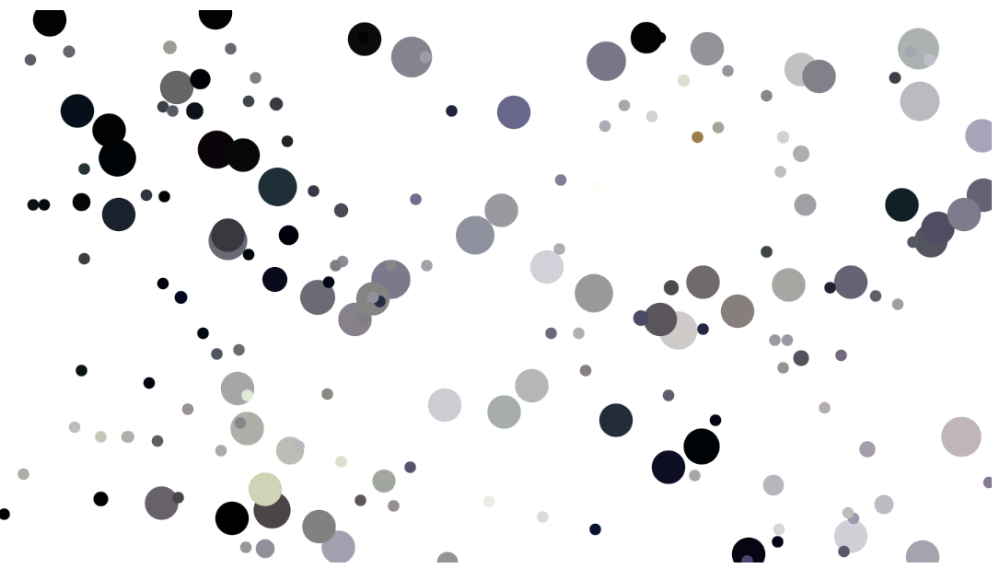

# zilu0433_9103_tut02_quiz8

**Raserch report-Pointillism**

[Link to the code](https://p5js.org/examples/image-pointillism.html)

    Part 1: Imaging technique Inspiration

        Pointillism is a method to Create a simple stipple effect using dots randomly based on the colors in the image in p5.js, you can controlling the size of the dots with the horizontal position of the mouse. our team was choosing the cow picture for our final assignment, the picture contain a cow in the center and some color block at the back, so my thought is my ay be i can use this pointillism drawing method to create the background.

    part 2: Coding Technique Exploration

        This code is an interactive canvas based on pointillism technology created using the p5.js library. The main purpose is to randomly select pixels from an image and display them in the form of dots on the canvas.

        Benefit:

            1.In progress
                give people a feeling of this picture is in progress, it make the experience last longer.

            2.Interaction
                Not only for viewing, but also for the audience to interact with it while watching.
              